# 简介

为什么要有 TCP/IP 网络模型？对于不同设备上的进程间通信，就需要网络通信，而设备是多样性的，所以要兼容多种多样的设备，就协商出了一套**通用的网络协议**。

这个网络协议是分层的，每一层都有各自的作用和职责，接下来就根据「 TCP/IP 网络模型」分别对每一层进行介绍。

除了标准的OSI七层模型以外，常见的网络层次划分还有TCP/IP四层协议以及TCP/IP五层协议，它们之间的对应关系如下图所示：

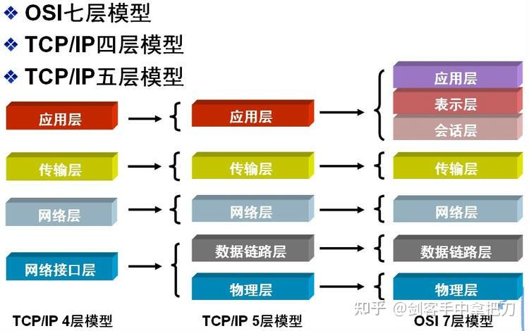

## 应用层

**应用层只需要专注于为用户提供应用功能，不用去关心数据是如何传输的**，比如 HTTP、FTP、Telnet、DNS、SMTP等。

而且**应用层是工作在操作系统中的用户态，传输层及以下则工作在内核态**。

## 传输层

应用层的数据包会传给传输层，**传输层（*Transport Layer*）是为应用层提供网络支持的，负责将数据从一个应用传输到另一个应用**。在传输层会有两个传输协议，分别是 TCP 和 UDP。

**TCP 的全称叫传输控制协议（Transmission Control Protocol）**，大部分应用使用的正是 TCP 传输层协议，比如 HTTP 应用层协议。TCP 相比  UDP 多了很多特性，比如流量控制、超时重传、拥塞控制等，这些都是为了保证数据包能可靠地传输给对方。

**UDP 相对来说就很简单，简单到只负责发送数据包，不保证数据包是否能抵达对方**，但它实时性相对更好，传输效率也高。当然，UDP 也可以实现可靠传输，把 TCP 的特性在应用层上实现就可以，不过要实现一个商用的可靠 UDP 传输协议，也不是一件简单的事情。

应用需要传输的数据可能会非常大，如果直接传输就不好控制，因此当传输层的数据包大小超过 **MSS（TCP 最大报文段长度）** ，就要将数据包分块，这样即使中途有一个分块丢失或损坏了，只需要重新发送这一个分块，而不用重新发送整个数据包。在 TCP 协议中，我们把每个分块称为一个 **TCP 段**。

当设备作为接收方时，传输层则要负责把数据包传给应用，但是一台设备上可能会有很多应用在接收或者传输数据，因此需要用一个编号将应用区分开来，这个编号就是**端口**。

## 网络层

传输层可能大家刚接触的时候，会认为它负责将数据从一个设备传输到另一个设备，事实上它并不负责。

实际场景中的网络环节是错综复杂的，中间有各种各样的线路和分叉路口，如果一个设备的数据要传输给另一个设备，就需要在各种各样的路径和节点进行选择。我们不希望传输层协议处理太多的事情，只需要服务好应用即可，让其作为应用间数据传输的媒介，帮助实现应用到应用的通信，而实际的传输功能就交给下一层，也就是网络层。

**网络层最常使用的是 IP 协议（Internet Protocol）**，IP 协议会将传输层的报文作为数据部分，再加上 IP 包头组装成 IP 报文，如果 IP 报文大小超过 **MTU（以太网中一般为 1500 字节）**就会再次进行分片，得到一个即将发送到网络的 IP 报文。

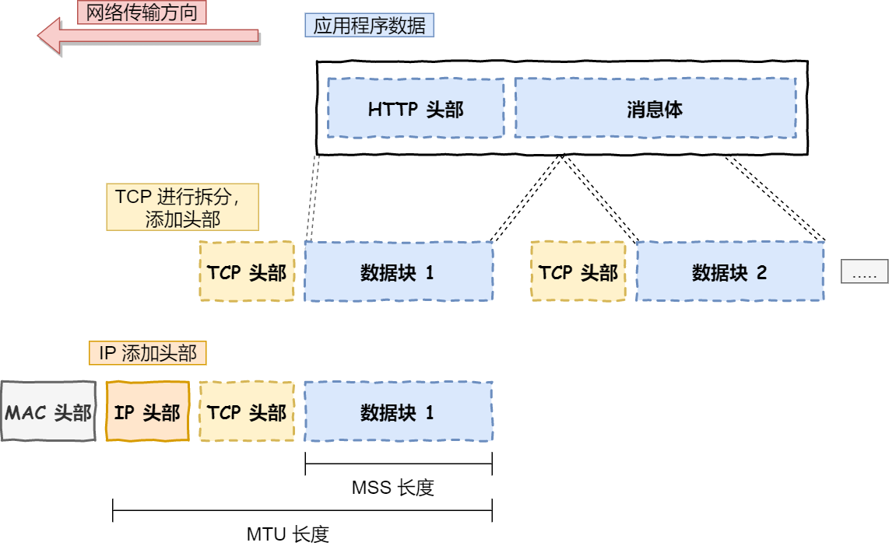

网络层负责将数据从一个设备传输到另一个设备，世界上那么多设备，又该如何找到对方呢？因此，网络层需要有区分设备的编号。**我们一般用 IP 地址给设备进行编号，便于寻址**，对于 IPv4 协议， IP 地址共 32 位，分成了四段（比如，192.168.100.1），每段是 8 位。

只有一个单纯的 IP 地址虽然做到了区分设备，但是寻址起来就特别麻烦，全世界那么多台设备，难道一个一个去匹配？这显然不科学。因此，需要将 IP 地址分成两种意义：

- 一个是**网络号**，负责标识该 IP 地址是属于哪个「子网」的；
- 一个是**主机号**，负责标识同一「子网」下的不同主机；

怎么分的呢？这需要配合**子网掩码**才能算出 IP 地址 的网络号和主机号。举个例子，比如 10.100.122.0/24，后面的`/24`表示就是`255.255.255.0` 子网掩码，255.255.255.0 二进制是「11111111-11111111-11111111-00000000」。将 10.100.122.2 和 255.255.255.0 进行按位与运算，就可以得到网络号。将 255.255.255.0 取反后与IP地址进行按位与运算，就可以得到主机号。

那么在寻址的过程中，先匹配到相同的网络号（表示要找到同一个子网），才会去找对应的主机。

除了寻址能力， IP 协议还有另一个重要的能力就是**路由**。实际场景中，两台设备并不是用一条网线连接起来的，而是通过很多网关、路由器、交换机等众多网络设备连接起来的，那么就会形成很多条网络的路径，因此当数据包到达一个网络节点，就需要通过路由算法决定下一步走哪条路径。

路由器寻址工作中，就是要找到目标地址的子网，找到后进而把数据包转发给对应的网络内。

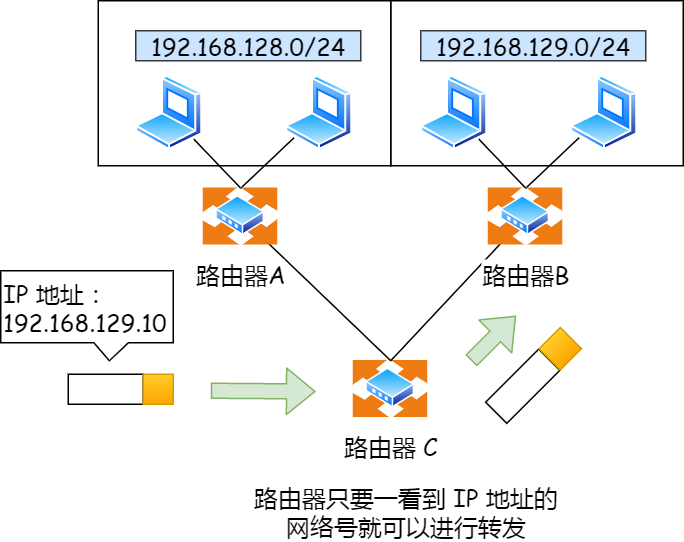

IP 协议的寻址作用是告诉我们去往下一个目的地该朝哪个方向走，路由则是根据「下一个目的地」选择路径。寻址更像在导航，路由更像在操作方向盘。

IP 中还包括 `ICMP` 协议和 `ARP` 协议。

- `ICMP` 用于告知网络包传送过程中产生的错误以及各种控制信息。
- `ARP` 用于根据 IP 地址查询相应的以太网 MAC 地址。

## 数据链路层

生成了 IP 头部之后，接下来要交给**数据链路层（Data Link Layer）**在 IP 头部的前面加上 MAC 头部，并封装成**数据帧（Data frame）**发送到网络上。

IP 头部中的接收方 IP 地址表示网络包的目的地，通过这个地址我们就可以判断要将包发到哪里，但在以太网的世界中，这个思路是行不通的。**以太网就是一种在「局域网」内，把附近的设备连接起来，使它们之间可以进行通讯的技术**。电脑上的以太网接口，Wi-Fi接口，以太网交换机、路由器上的千兆，万兆以太网口，还有网线，它们都是以太网的组成部分。

以太网在判断网络包目的地时和 IP 的方式不同，因此必须采用相匹配的方式才能在以太网中将包发往目的地，而 MAC 头部就是干这个用的，所以，在以太网进行通讯要用到 **MAC 地址**。MAC 头部是以太网使用的头部，它包含了接收方和发送方的 MAC 地址等信息，我们可以通过 ARP 协议获取对方的 MAC 地址。

所以说，**数据链路层主要为网络层提供「链路级别」传输的服务**，负责在以太网、WiFi 这样的底层网络上发送原始数据包，工作在网卡这个层次，使用 MAC 地址来标识网络上的设备。

## 物理层

该层为上层协议提供了一个传输数据的可靠的物理媒体。简单的说，物理层确保原始的数据可在各种物理媒体上传输。

## 总结

- 计算机网络协议是分层的，下层为上层提供支持。常见的有TCP/IP四层协议、TCP/IP五层协议，和OSI七层协议
- TCP/IP五层协议
  - 应用层：为用户提供应用功能，如HTTP、DNS、SMTP。它工作在操作系统用户态，其它层工作在内核态
  - 传输层：负责将数据从一个应用传输到另一个应用，它使用 TCP、UDP 协议。
    - 一台机器的不同应用通过端口区分
    - TCP 是可靠传输，还有流量控制、超时重传、拥塞控制等功能
    - UDP 只简单传输数据包，不保证可靠传输
    - MSS：TCP 最大报文段长度。把上一层的数据分割合并成一个个 MSS，加上TCP头部组成TCP报文
  - 网络层：负责将数据从一个设备传输到另一个设备。它使用IP协议，还有ICMP、ARP 协议。
    - IP 地址给设备进行编号，便于寻址。IP 地址有 32 位、128位。32 位分成四段，每段 8 位，例如 `192.168.0.1`
      -  IP 地址分成两部分：网络号（表示子网）和主机号（表示子网下的主机）。
      - 通过子网掩码算出网络号和主机号，例如 `192.168.0.1/24`。
      - 寻址就是先匹配子网，在匹配主机
    - IP 协议另一个功能就是路由：两个设备间会有很多节点和路径，路由决定下一步要走什么路径。也就是找到下一步的子网，然后把数据包转发给对应的网络内。
    - MTU：IP最大报文长度，包括IP头部，以太网中一般为 1500 字节。在TCP/UDP报文上加上IP头部组成IP报文
  - 数据链路层：为网络层提供「链路级别」传输的服务，负责在以太网这样的底层网络上发送数据包，工作在网卡这个层次，使用 MAC 地址来标识网络上的设备。
    - 在 IP 头部的前面加上 MAC 头部，并封装成数据帧（Data frame）
    - 以太网在局域网中采用相匹配的方式将包发往目的地，匹配要使用MAC地址
  - 物理层：为上层提供了一个传输数据的可靠物理媒体，例如网线、WIFI等。

# 键入网址到网页显示，期间发生了什么？

接下来以下图较简单的网络拓扑模型作为例子，探究探究其间发生了什么？

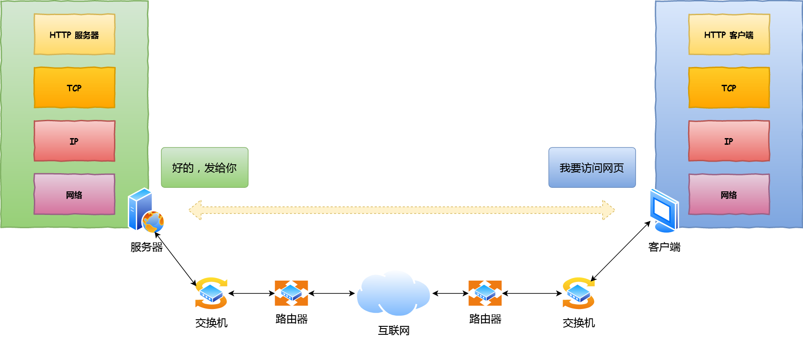

## 孤单小弟 —— HTTP

### 解析URL

首先浏览器做的第一步工作就是要对 `URL` 进行解析，从而生成发送给 `Web` 服务器的请求信息。

当没有路径名时，就代表访问根目录下事先设置的**默认文件**，也就是 `/index.html` 或者`/default.html` 这些文件，这样就不会发生混乱了。

### 生产 HTTP 请求信息

对 `URL` 进行解析之后，浏览器确定了 Web 服务器和文件名，接下来就是根据这些信息来生成 HTTP 请求消息了。

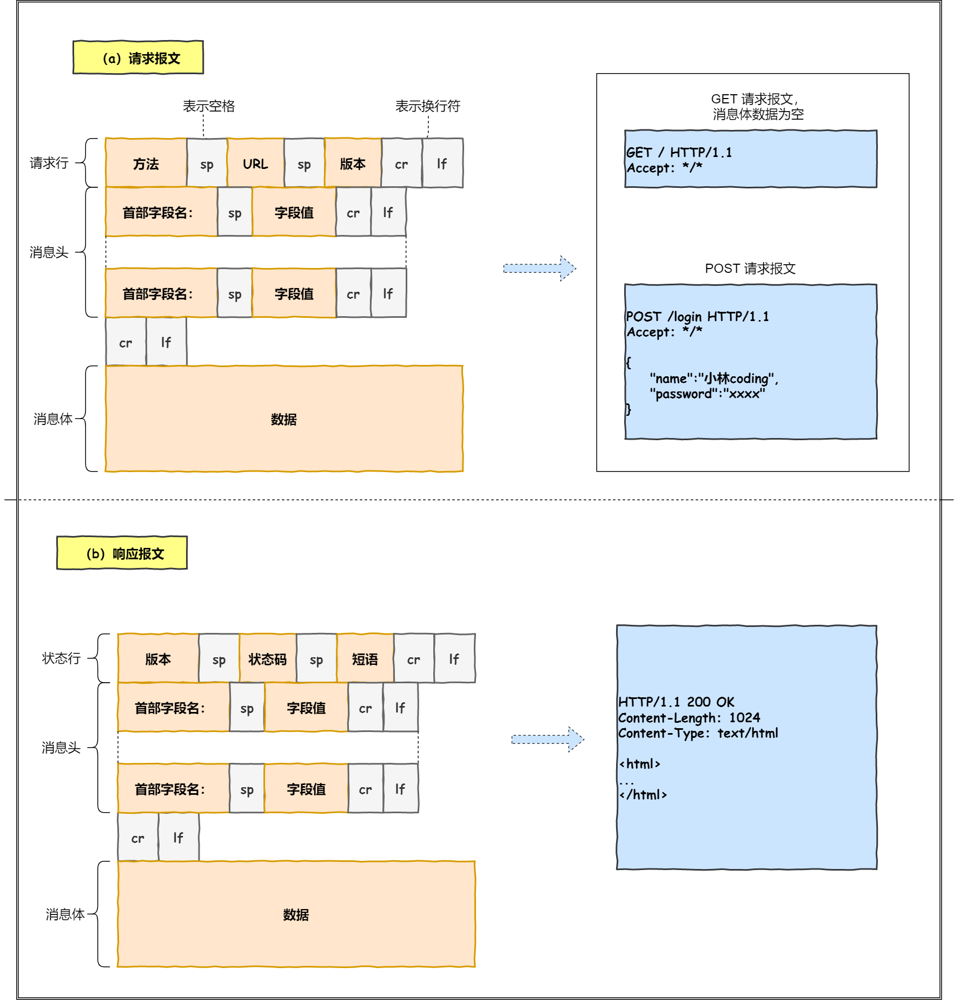

## 真实地址查询 —— DNS

- 域名都是用句点来分隔的，比如 `www.server.com.`，越靠右层级越高。每个层级都有一个DNS服务器负责解析域名。最后一个点是根域名，可不写。
  - 根 DNS 服务器（.）：根域的 DNS 服务器信息保存在互联网中所有的 DNS 服务器中
  - 顶级域 DNS 服务器（.com）
  - 权威 DNS 服务器（server.com）
- 解析流程
  - 浏览器缓存 -> 操作系统缓存 -> hosts文件
  - 客户端向本地DNS服务器（客户端设置中填写的地址）发送DNS请求
  - 本地DNS服务器缓存中未找到，就向根域名服务器发送DNS请求，它返回顶级域 DNS 服务器地址
  - 本地DNS服务器再向顶级域 DNS 服务器发送DNS请求，它返回权威 DNS 服务器地址
  - 本地DNS服务器再向权威 DNS 服务器发送DNS请求，它返回最终的 IP 地址
  - 本地DNS服务器将 IP 地址返回给客户端

## 指南好帮手 —— 协议栈

通过 DNS 获取到 IP 后，就可以把 HTTP 的传输工作交给操作系统中的**协议栈**。

协议栈的内部分为几个部分，分别承担不同的工作。上下关系是有一定的规则的，上面的部分会向下面的部分委托工作，下面的部分收到委托的工作并执行。

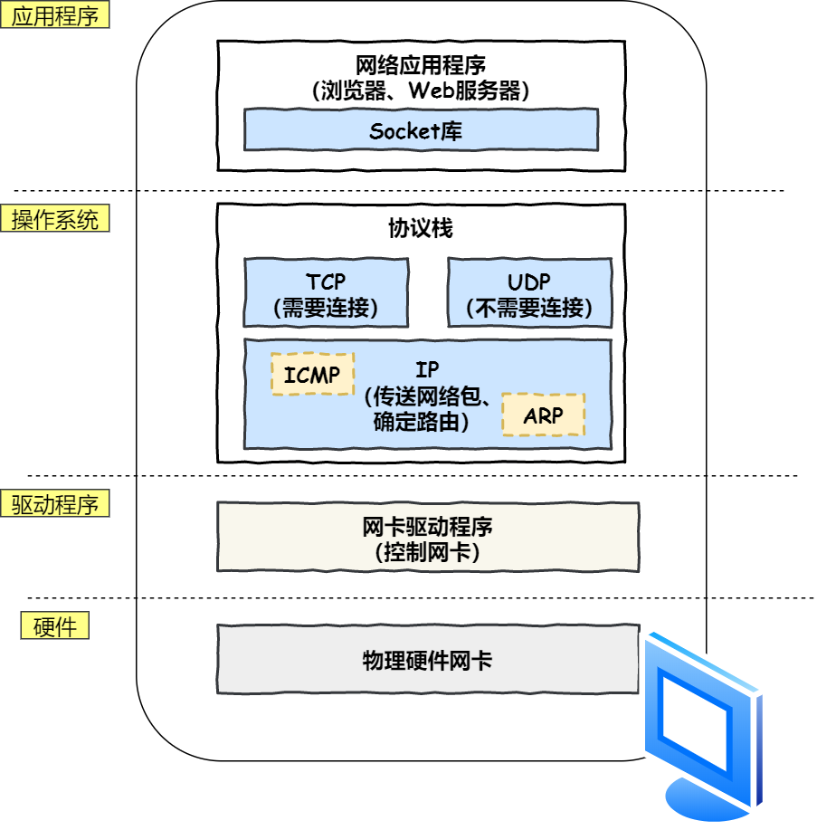

## 可靠传输 —— TCP

HTTP 是基于 TCP 协议传输的，所以在这我们先了解下 TCP 协议。

### TCP 包头格式

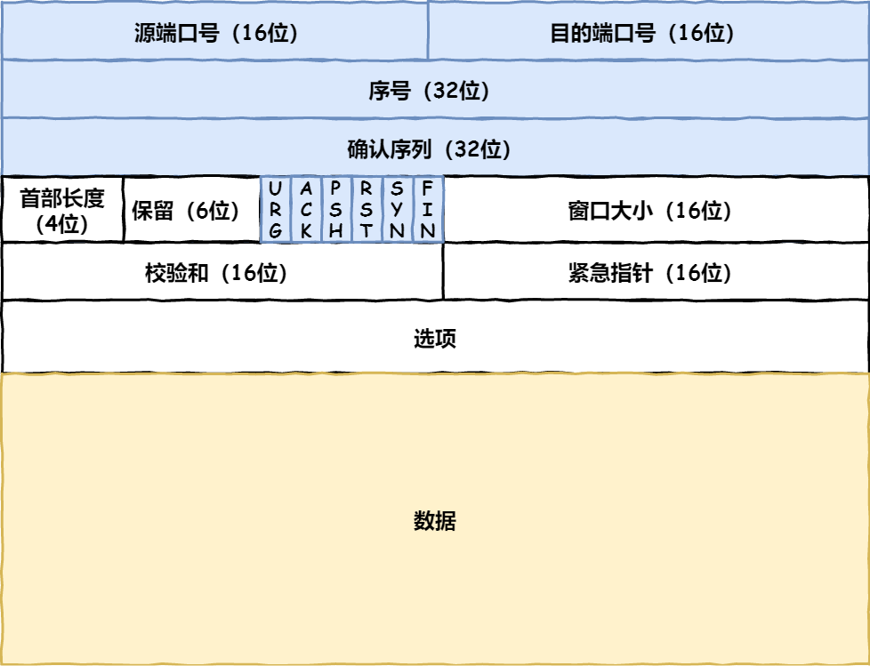

包的**序号**，这个是为了解决包乱序的问题。

**确认号**，目的是确认发出去对方是否有收到。如果没有收到就应该重新发送，直到送达，这个是为了解决丢包的问题。

接下来还有一些**状态位**。例如 `SYN` 是发起一个连接，`ACK` 是回复，`RST` 是重新连接，`FIN` 是结束连接等。TCP 是面向连接的，因而双方要维护连接的状态，这些带状态位的包的发送，会引起双方的状态变更。

**窗口大小**。TCP 要做**流量控制**，通信双方各声明一个窗口（缓存大小），标识自己当前能够的处理能力。

除了做流量控制以外，TCP还会做**拥塞控制**，对于真正的通路堵车不堵车，它无能为力，唯一能做的就是控制自己，也即控制发送的速度。

### TCP 传输数据之前，要先三次握手建立连接

在 HTTP 传输数据之前，首先需要 TCP 建立连接，TCP 连接的建立，通常称为**三次握手**。这个所谓的「连接」，只是双方计算机里维护一个状态机，在连接建立的过程中，双方的状态变化时序图就像这样。

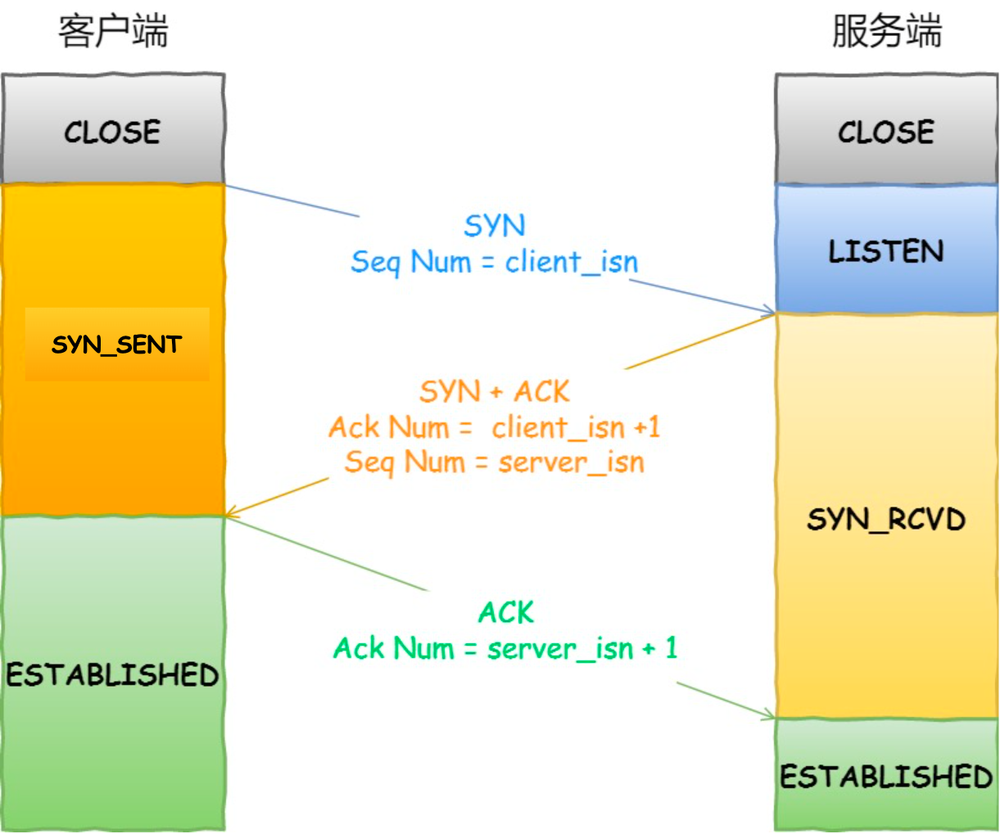

- 一开始，客户端和服务端都处于 `CLOSED` 状态。先是服务端主动监听某个端口，处于 `LISTEN` 状态。
- 然后客户端主动发起连接 `SYN`，之后处于 `SYN-SENT` 状态。
- 服务端收到发起的连接，返回 `SYN`，并且 `ACK` 客户端的 `SYN`，之后处于 `SYN-RCVD` 状态。
- 客户端收到服务端发送的 `SYN` 和 `ACK` 之后，发送对 `SYN` 确认的 `ACK`，之后处于 `ESTABLISHED` 状态，因为它一发一收成功了。
- 服务端收到 `ACK` 的 `ACK` 之后，处于 `ESTABLISHED` 状态，因为它也一发一收了。

详情见TCP章节

#### 如何查看 TCP 的连接状态？

TCP 的连接状态查看，在 Linux 可以通过 `netstat -napt` 命令查看。

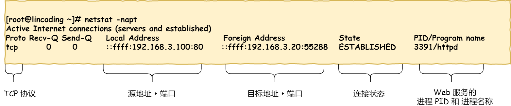

### TCP 分割数据

如果 HTTP 请求消息比较长，超过了 `MSS` 的长度，这时 TCP 就需要把 HTTP 的数据拆解成一块块的数据发送，而不是一次性发送所有数据。

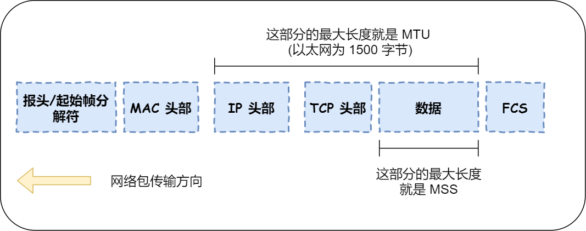

- `MTU`：一个网络包的最大长度，以太网中一般为 `1500` 字节。
- `MSS`：除去 IP 和 TCP 头部之后，一个网络包所能容纳的 TCP 数据的最大长度。

### TCP 报文生成

TCP 协议里面会有两个端口，一个是浏览器监听的端口（通常是随机生成的），一个是 Web 服务器监听的端口（HTTP 默认端口号是 `80`，  HTTPS 默认端口号是 `443`）。

在双方建立了连接后，TCP 报文中的数据部分就是存放 HTTP 头部 + 数据，组装好 TCP 报文之后，就需交给下面的网络层处理。

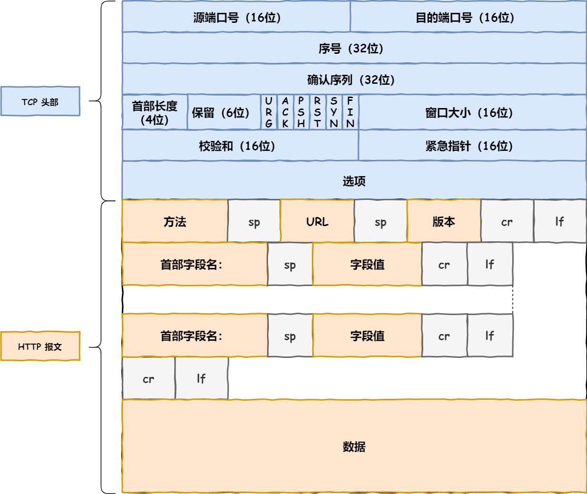

## 远程定位 —— IP

TCP 模块在执行连接、收发、断开等各阶段操作时，都需要委托 IP 模块将数据封装成**网络包**发送给通信对象。

### IP 包头格式

因为 HTTP 是经过 TCP 传输的，所以在 IP 包头的**协议号**，要填写为 `06`（十六进制），表示协议为 TCP。

### 假设客户端有多个网卡，就会有多个 IP 地址，那 IP 头部的源地址应该选择哪个 IP 呢？

这个时候就需要根据**路由表**规则，来判断哪一个网卡作为源地址 IP。在 Linux 操作系统，我们可以使用 `route -n` 命令查看当前系统的路由表。

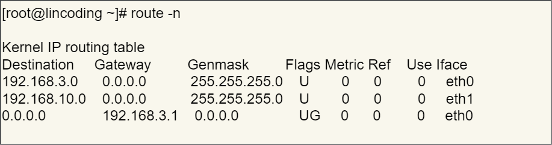

举个例子，根据上面的路由表，我们假设 Web 服务器的目标地址是 `192.168.10.200`。

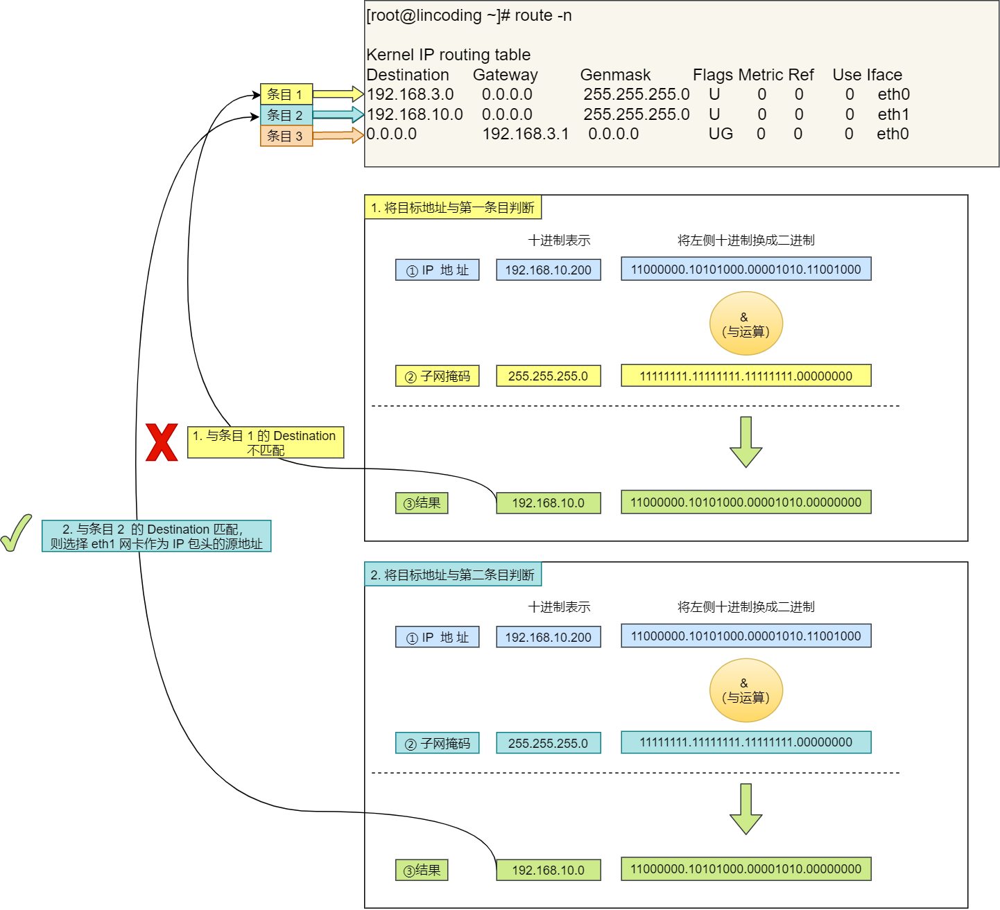

第三条目比较特殊，它目标地址和子网掩码都是 `0.0.0.0`，这表示**默认网关**，如果其他所有条目都无法匹配，就会自动匹配这一行。并且后续就把包发给路由器，`Gateway` 即是路由器的 IP 地址。

网关参见《网络构造》章节。

### IP 报文生成

## 两点传输 —— MAC

生成了 IP 头部之后，接下来网络包还需要在 IP 头部的前面加上 **MAC 头部**。

### MAC 包头格式

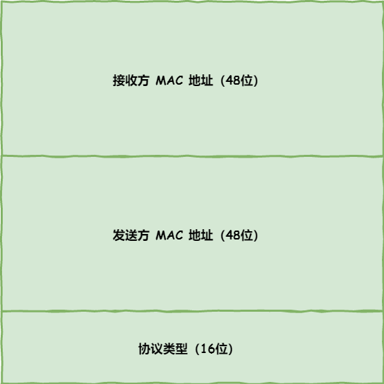

一般在 TCP/IP 通信里，MAC 包头的**协议类型**只使用：

- `0800` ： IP 协议
- `0806` ： ARP 协议

### MAC 发送方和接收方如何确认?

**发送方**的 MAC 地址获取就比较简单了，MAC 地址是在网卡生产时写入到 ROM 里的，只要将这个值读取出来写入到 MAC 头部就可以了。

搞清楚应该把包发给谁，这个只要查一下**路由表**就知道了。在路由表中找到相匹配的条目，然后把包发给 `Gateway` 列中的 IP 地址就可以了。不知道对方 MAC 地址？不知道就喊呗。此时就需要 `ARP` 协议帮我们找到路由器的 MAC 地址。

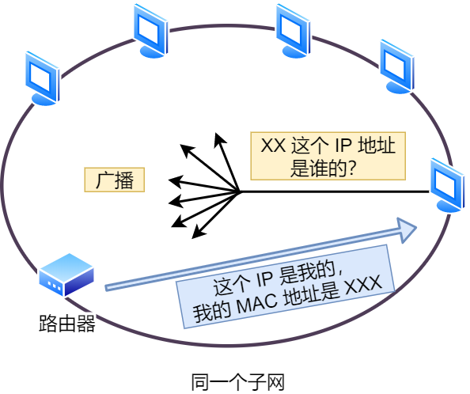

如果对方和自己处于同一个子网中，那么通过上面的操作就可以得到对方的 MAC 地址。然后，我们将这个 MAC 地址写入 MAC 头部，MAC 头部就完成了。

后续操作系统会把本次查询结果放到一块叫做 **ARP 缓存**的内存空间留着以后用，不过缓存的时间就几分钟。

也就是说，在发包时：

1. 先查询 ARP 缓存，如果其中已经保存了对方的 MAC 地址，就不需要发送 ARP 查询，直接使用 ARP 缓存中的地址。
2. 而当 ARP 缓存中不存在对方 MAC 地址时，则发送 ARP 广播查询。

#### 查看 ARP 缓存内容

在 Linux 系统中，我们可以使用 `arp -a` 命令来查看 ARP 缓存的内容。

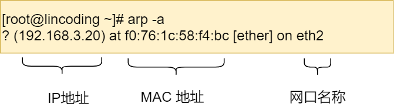

### MAC 报文生成

## 出口 —— 网卡

网络包只是存放在内存中的一串二进制数字信息，没有办法直接发送给对方。因此，我们需要将**数字信息转换为电信号**，才能在网线上传输，也就是说，这才是真正的数据发送过程。负责执行这一操作的是**网卡**，要控制网卡还需要靠**网卡驱动程序**。

网卡驱动获取网络包之后，会将其**复制**到网卡内的缓存区中，接着会在其**开头加上报头和起始帧分界符，在末尾加上用于检测错误的帧校验序列**。

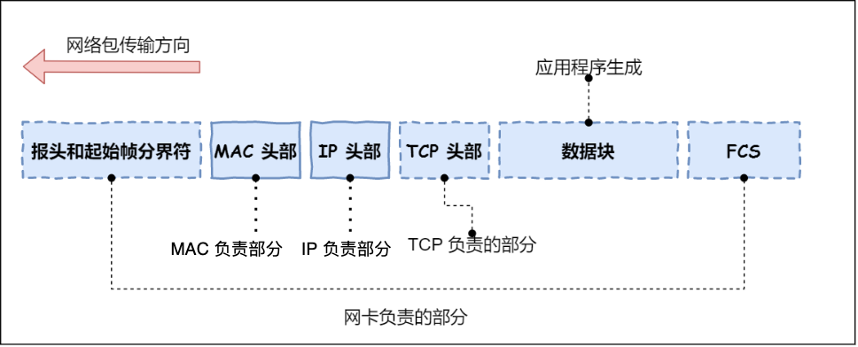

## 送别者 —— 交换机

**交换机（Switch）**主要用于局域网（LAN）中设备之间的数据转发和通信。它能够根据数据帧中的目标MAC地址，将数据帧转发到正确的目标设备。

数据包通过交换机转发抵达了路由器，准备要离开土生土长的子网了。不过现在家里的路由器其实有了交换机的功能了。

详情参见《网络构造》

## 出境大门 —— 路由器

路由器通过路由表层层路由，直到到达最终目的地。

## 互相扒皮 —— 服务器 与 客户端

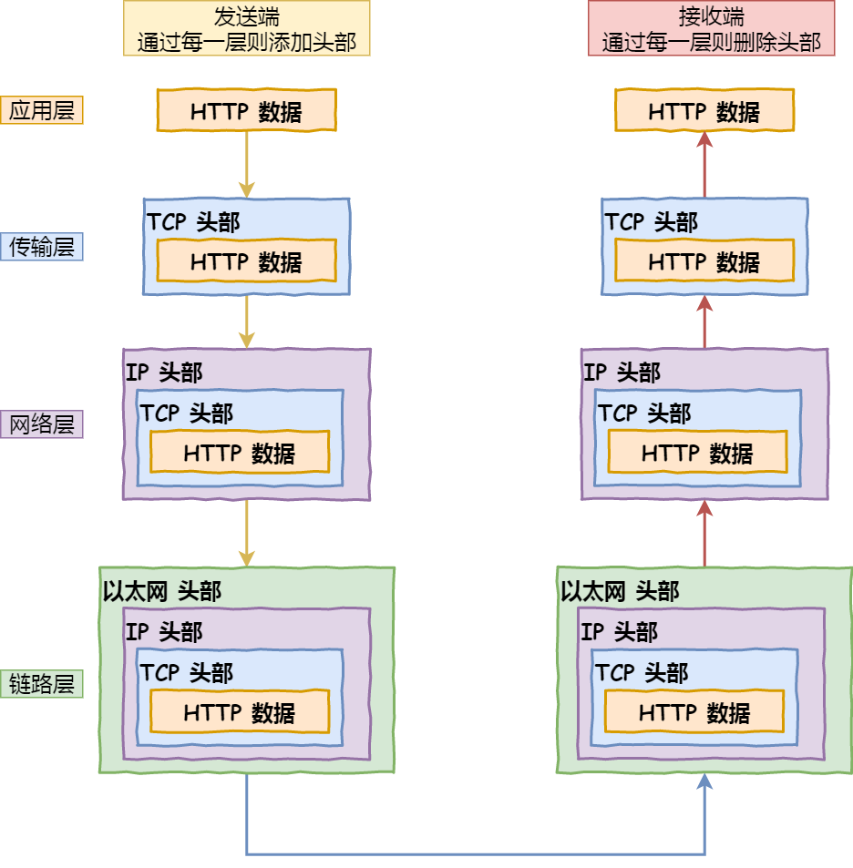

## 总结

- 首先浏览器根据HTTP协议对 `URL` 进行解析，生成发送给 `Web` 服务器的 HTTP 请求消息，包括请求行、消息头、消息体。
- 然后使用DNS协议进行域名解析
  - 域名都是用句点来分隔的，比如 `www.server.com.`，越靠右层级越高。每个层级都有一个DNS服务器负责解析域名。最后一个点是根域名，可不写。
    - 根 DNS 服务器（.）：根域的 DNS 服务器信息保存在互联网中所有的 DNS 服务器中
    - 顶级域 DNS 服务器（.com）
    - 权威 DNS 服务器（server.com）
  - 解析流程
    - 浏览器缓存 -> 操作系统缓存 -> hosts文件
    - 客户端向本地DNS服务器（客户端设置中填写的地址）发送DNS请求
    - 本地DNS服务器缓存中未找到，就向根域名服务器发送DNS请求，它返回顶级域 DNS 服务器地址
    - 本地DNS服务器再向顶级域 DNS 服务器发送DNS请求，它返回权威 DNS 服务器地址
    - 本地DNS服务器再向权威 DNS 服务器发送DNS请求，它返回最终的 IP 地址
    - 本地DNS服务器将 IP 地址返回给客户端
- 通过 DNS 获取到 IP 后，就可以把 HTTP 的传输工作交给操作系统中的协议栈。协议栈包含TCP、UDP、IP等协议。它下面是网卡驱动程序，再下面是物理网卡
- 协议栈通过 TCP 协议传输数据，先要经过TCP三次握手建立TCP连接。
  - TCP 包头包含 源&目的端口号、序号（解决乱序）、确认号（解决丢包）、窗口大小（流量控制）、状态位（SYN、ACK、FIN等）等字段
  - Linux 可以通过 `netstat -napt` 命令查看 TCP 的连接状态

- TCP 模块在执行连接、收发、断开等操作时，都需要委托 IP 模块将数据封装成网络包发送给对方。
  - IP 包头包含源&目的IP地址、协议类型（TCP|UDP）、长度等字段
  - 客户端根据路由表规则决定选择哪一个网卡作为源地址 IP，也就是判断目标地址和哪个网卡的IP子网匹配。如果都不匹配，就会选择 `0.0.0.0`，后续会把数据包发送给它的网关，一般是路由器
  -  Linux 可以通过 `route -n` 命令查看当前系统的路由表

- 生成了 IP 头部之后，接下来网络包还需要在 IP 头部的前面加上 MAC 头部。它包含源&目的MAC地址，还有协议类型（IP、ARP）字段。
  - 发送方的 MAC 地址
  - 接收方 MAC 地址通过以下流程获取：
    - 先查询 ARP 缓存
    - 不在缓存中就在子网中发送ARP广播，获取下一跳的MAC地址

- 网卡驱动在数据包开头加上报头和起始帧分界符，在末尾加上用于检测错误的帧校验序列，复制到网卡缓冲区中。网卡将数字信息转换为电信号发送出去。
- 交换机根据目的MAC地址，把数据包转发给它（也就是路由器）。
- 路由器根据路由表确定下一跳，再经过下一个交换机、路由器，就这样层层转发直到目的地。
- 服务器的协议栈对数据包进行解包，获取到里面的HTTP数据。处理后生成响应，再按上面的流程发送给给客户端。

# Linux 系统是如何收发网络包的？

我们比较常见，也比较实用的是四层模型，即 TCP/IP 网络模型，Linux 系统正是按照这套网络模型来实现网络协议栈的。

## Linux 网络协议栈

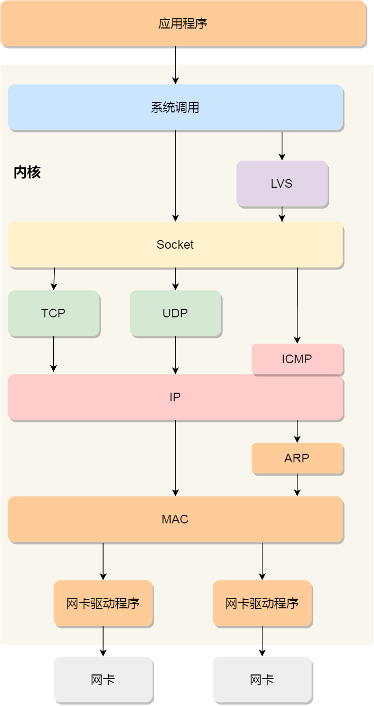

## Linux 接收网络包的流程

当网卡接收到一个网络包后，会通过 **DMA 技术**，将网络包写入到指定的内存地址，也就是写入到 **Ring Buffer** ，这个是一个环形缓冲区，接着就会告诉操作系统这个网络包已经到达。

### 那应该怎么告诉操作系统这个网络包已经到达了呢？

最简单的一种方式就是触发中断，也就是每当网卡收到一个网络包，就触发一个中断告诉操作系统。

但是，这存在一个问题，在高性能网络场景下，网络包的数量会非常多，那么就会触发非常多的中断，要知道当 CPU  收到了中断，就会停下手里的事情，而去处理这些网络包，处理完毕后，才会回去继续其他事情，那么频繁地触发中断，则会导致 CPU 一直没完没了的处理中断，而导致其他任务可能无法继续前进，从而影响系统的整体效率。

所以为了解决频繁中断带来的性能开销，Linux 内核在 2.6 版本中引入了 **NAPI 机制**，它是混合「中断和轮询」的方式来接收网络包，它的核心概念就是**不采用中断的方式读取数据**，而是首先采用中断唤醒数据接收的服务程序，然后 `poll` 的方法来轮询数据。

因此当 CPU 收到硬件中断请求后，根据中断表，调用已经注册的中断处理函数。**硬件中断处理函数**会做如下的事情：

- 需要先「暂时屏蔽中断」，表示已经知道内存中有数据了，告诉网卡下次再收到数据包直接写内存就可以了，不要再通知 CPU 了，这样可以提高效率，避免 CPU 不停的被中断。
- 接着，发起「软中断」，然后恢复刚才屏蔽的中断。

硬件中断处理函数做的事情很少，主要耗时的工作都交给软中断处理函数了。

### 软中断的处理

内核中的 ksoftirqd 线程专门负责软中断的处理，当 ksoftirqd 内核线程收到软中断后，就会来轮询处理数据。ksoftirqd 线程会从 Ring Buffer 中获取一个数据帧，用 sk_buff 表示，从而可以作为一个网络包交给网络协议栈进行逐层处理。

1. 首先，会先进入到网络接口层，在这一层会检查报文的合法性，如果不合法则丢弃，合法则会找出该网络包的上层协议的类型，比如是 IPv4，还是 IPv6，接着再去掉帧头和帧尾，然后交给网络层。

2. 到了网络层，则取出 IP 包，判断网络包下一步的走向，比如是交给上层处理还是转发出去。当确认这个网络包要发送给本机后，就会从 IP 头里看看上一层协议的类型是 TCP 还是 UDP，接着去掉 IP 头，然后交给传输层。

3. 传输层取出 TCP 头或 UDP 头，根据四元组「源 IP、源端口、目的 IP、目的端口」 作为标识，找出对应的 Socket，并把数据放到 Socket 的接收缓冲区。

4. 最后，应用层程序调用 Socket 接口，将内核的 Socket 接收缓冲区的数据「拷贝」到应用层的缓冲区，然后唤醒用户进程。

## Linux 发送网络包的流程

发送网络包的流程正好和接收流程相反。

首先，应用程序会调用 Socket 发送数据包的接口，由于这个是系统调用，所以会从用户态陷入到内核态中的 Socket 层。内核会申请一个内核态的 sk_buff 内存，**将用户待发送的数据拷贝到 sk_buff 内存，并将其加入到发送缓冲区**。

接下来，网络协议栈从 Socket 发送缓冲区中取出 sk_buff，并按照 TCP/IP 协议栈从上到下逐层处理。

如果使用的是 TCP 传输协议发送数据，那么**先拷贝一个新的 sk_buff 副本** ，这是因为 sk_buff 后续在调用网络层，最后到达网卡发送完成的时候，这个 sk_buff 会被释放掉。而 TCP 协议是支持丢失重传的，在收到对方的 ACK 之前，这个 sk_buff 不能被删除。

接着，对 sk_buff 填充 TCP 头。这里提一下，sk_buff 可以表示各个层的数据包，在应用层数据包叫 data，在 TCP 层我们称为 segment，在 IP 层我们叫 packet，在数据链路层称为 frame。

在层级之间传递数据时，不发生拷贝，只用 sk_buff 一个结构体来描述所有的网络包，那它是如何做到的呢？是通过调整 sk_buff 中 `data` 的指针，比如：

- 当接收报文时，从网卡驱动开始，通过协议栈层层往上传送数据报，通过增加 skb->data 的值，来逐步剥离协议首部。
- 当要发送报文时，创建 sk_buff 结构体，数据缓存区的头部预留足够的空间，用来填充各层首部，在经过各下层协议时，通过减少 skb->data 的值来增加协议首部。

然后交给网络层，在网络层里会做这些工作：选取路由（确认下一跳的 IP）、填充 IP 头、netfilter 过滤、对超过 MTU 大小的数据包进行分片。处理完这些工作后会交给网络接口层处理。

网络接口层会通过 ARP 协议获得下一跳的 MAC 地址，然后对 sk_buff 填充帧头和帧尾，接着将 sk_buff 放到网卡的发送队列中。

这一些工作准备好后，会触发「软中断」告诉网卡驱动程序，这里有新的网络包需要发送，驱动程序会从发送队列中读取 sk_buff，将这个 sk_buff 挂到 RingBuffer 中，接着将 sk_buff 数据映射到网卡可访问的内存 DMA 区域，最后触发真实的发送。

当数据发送完成以后，其实工作并没有结束，因为内存还没有清理。当发送完成的时候，网卡设备会触发一个硬中断来释放内存，主要是释放 sk_buff 内存和清理  RingBuffer 内存。

最后，当收到这个 TCP 报文的 ACK 应答时，传输层就会释放原始的 sk_buff 。

### 发送网络数据的时候，涉及几次内存拷贝操作？

第一次，调用发送数据的系统调用的时候，内核会申请一个内核态的 sk_buff 内存，将用户待发送的数据拷贝到 sk_buff 内存，并将其加入到发送缓冲区。

第二次，在使用 TCP 传输协议的情况下，从传输层进入网络层的时候，每一个 sk_buff 都会被克隆一个新的副本出来。副本 sk_buff 会被送往网络层，等它发送完的时候就会释放掉，然后原始的 sk_buff 还保留在传输层，目的是为了实现 TCP 的可靠传输，等收到这个数据包的 ACK 时，才会释放原始的 sk_buff 。

第三次，当 IP 层发现 sk_buff 大于 MTU 时才需要进行。会再申请额外的 sk_buff，并将原来的 sk_buff 拷贝为多个小的 sk_buff。