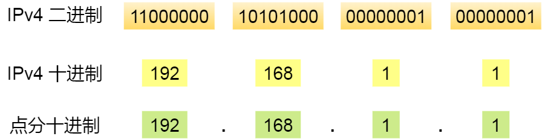
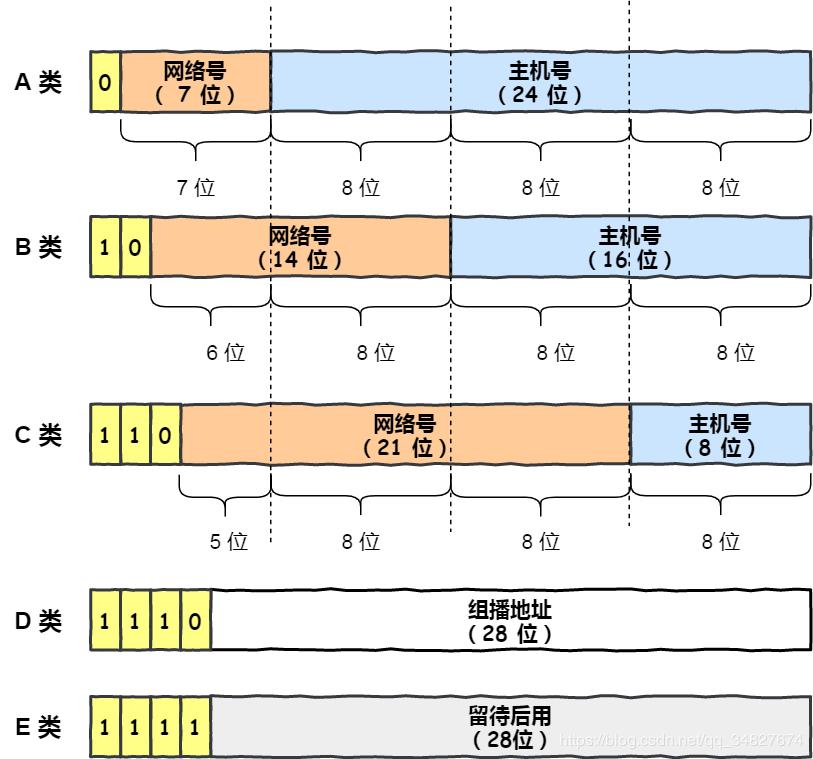
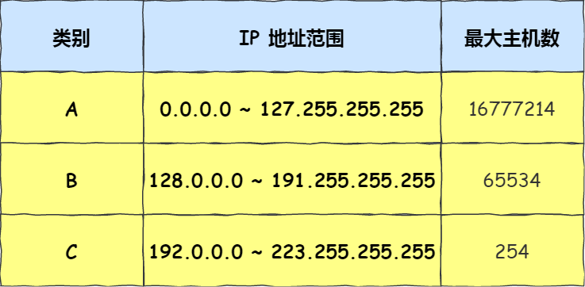
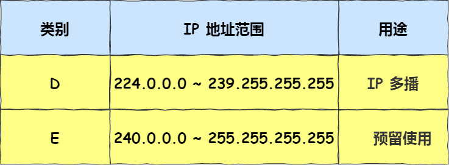
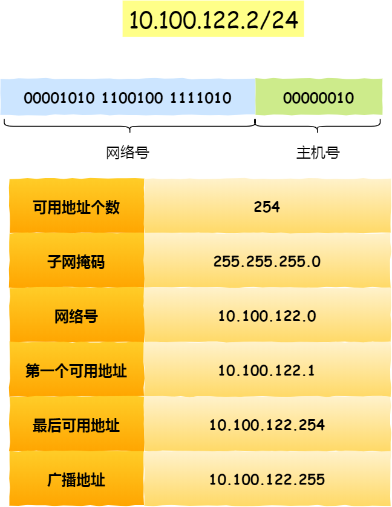
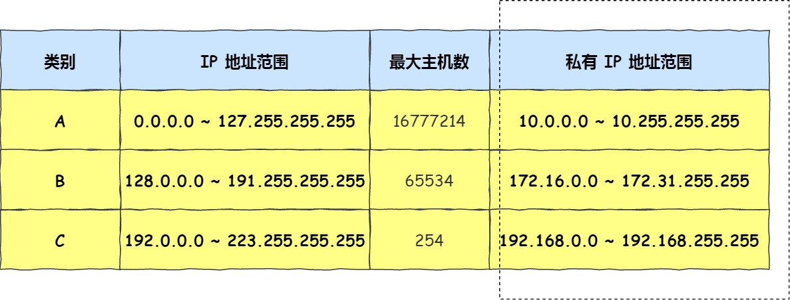
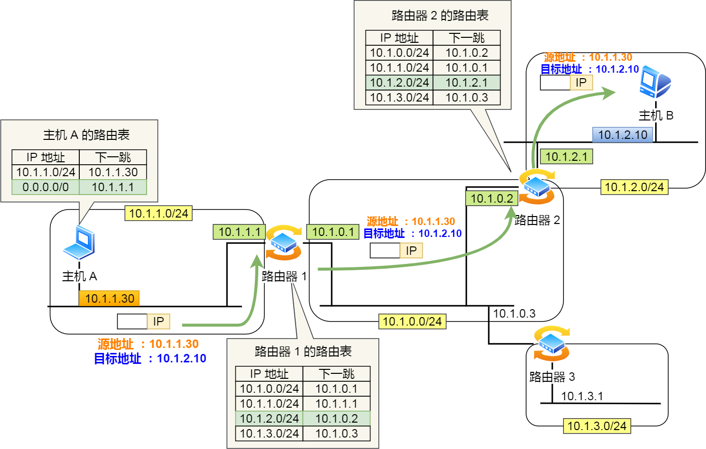

# 基本认识

IP 在 TCP/IP 参考模型中处于第三层，也就是**网络层**。网络层的主要作用是：**实现主机与主机之间的通信，也叫点对点（end to end）通信。**

它和MAC的区别：**MAC 的作用则是实现「直连」的两个设备之间通信，而 IP 则负责在「没有直连」的两个网络之间进行通信传输**。

其实，在网络中数据包传输中也是如此，**源IP地址和目标IP地址在传输过程中是不会变化的（前提：没有使用 NAT 网络），只有源 MAC 地址和目标 MAC 一直在变化**。

# 基础知识

## 格式和网卡

IP 地址（IPv4 地址）由 `32` 位正整数来表示，在计算机是以二进制的方式处理的。人类为了方便记忆采用了**点分十进制**的标记方式，也就是将 32 位 IP 地址以每 8 位为组，共分为 `4` 组，每组以「`.`」隔开，再将每组转换成十进制。

IP 地址并不是根据主机台数来配置的，而是以**网卡**。像服务器、路由器等设备都是有 2 个以上的网卡，也就是它们会有 2 个以上的 IP 地址。

## IP 地址的分类

互联网诞生之初，IP 地址显得很充裕，于是计算机科学家们设计了**分类地址**：A 类、B 类、C 类、D 类、E 类。

### A、B、C类

对于 A、B、C 类主要分为两个部分，分别是**网络号和主机号**。用下面这个表格， 能知道它们对应的地址范围、最大主机个数：

最大主机数要看主机号的位数，如 C 类地址的主机号占 8 位，那么最大主机数=$2^8-2=254$。

之所以减去2，是因为有两个 IP 是特殊的：

- 主机号全为 1 指定某个网络下的所有主机，用于**广播**：在同一个链路中相互连接的所有主机之间发送数据包。
- 主机号全为 0 指定某个网络

广播地址可以分为本地广播和直接广播两种：

- 在本网络内广播的叫做**本地广播**。例如网络地址为192.168.0.0/24 的情况下，广播地址是192.168.0.255 。这个广播地址的 IP 包会被路由器屏蔽，不会到达 192.168.0.0/24 以外的其他链路上。
- 在不同网络之间的广播叫做**直接广播**。例如网络地址为 192.168.0.0/24 的主机向192.168.1.255/24 的目标地址发送 IP 包。收到这个包的路由器，将数据转发给 192.168.1.0/24，从而使得所有 192.168.1.1~192.168.1.254 的主机都能收到这个包
  - 由于直接广播有一定的安全问题，多数情况下会在路由器上设置为不转发。

### D、E类

 D 类和 E 类地址是没有主机号的，所以不可用于主机 IP，D 类常被用于**多播**，E 类是预留的分类，暂时未使用。

多播用于**将包发送给特定组内的所有主机**。例如老师指定一个班最后一排的同学。广播无法穿透路由，若想给其他网段发送同样的包，就可以使用可以穿透路由的多播。

多播地址划分为以下三类：

- 224.0.0.0 ~ 224.0.0.255 为预留的组播地址，只能在局域网中，路由器是不会进行转发的。
- 224.0.1.0 ~ 238.255.255.255 为用户可用的组播地址，可以用于 Internet 上。
- 239.0.0.0 ~ 239.255.255.255 为本地管理组播地址，可供内部网在内部使用，仅在特定的本地范围内有效。

### 缺点

- **同一网络下没有地址层次**，比如一个公司里用了 B 类地址，但是可能需要根据生产环境、测试环境、开发环境来划分地址层次。而这种 IP 分类是没有地址层次划分的功能，所以这就**缺少地址的灵活性**。
- **不能很好的与现实网络匹配**：
  - C 类地址能包含的最大主机数量实在太少了，只有 254 个，估计一个网吧都不够用。
  - B 类地址能包含的最大主机数量又太多了，6 万多台机器放在一个网络下面，一般的企业基本达不到这个规模

## 无分类地址 CIDR

这种方式不再有分类地址的概念，IP地址被划分为**网络号**和**主机号**。

表示形式 `a.b.c.d/x`，其中 `/x` 表示前 x 位属于**网络号**， x 的范围是 `0 ~ 32`。比如 10.100.122.2/24：

其中有**子网掩码**，就是掩盖掉主机号，剩余的就是网络号。**将子网掩码和 IP 地址按位计算 AND，就可得到网络号。**

两台计算机要通讯，首先要判断是否处于同一个广播域内，即网络地址是否相同。如果网络地址相同，表明接受方在本网络上，那么可以把数据包直接发送到目标主机。

路由器寻址工作中，也就是通过这样的方式来找到对应的网络号的，进而把数据包转发给对应的网络内。

### 子网划分

子网掩码还有一个作用，那就是**划分子网**。也就是**将主机地址分为两个部分：子网网络地址和子网主机地址**：

- 未做子网划分的 ip 地址：网络地址＋主机地址
- 做子网划分后的 ip 地址：网络地址＋（子网网络地址＋子网主机地址）

假设对 C 类地址进行子网划分，网络地址 192.168.1.0，使用子网掩码 255.255.255.192 对其进行子网划分。根据子网掩码可知**从 8 位主机号中借用 2 位作为子网号**，那么子网地址就有 4 个，分别是 00、01、10、11。

## 公有 IP 地址与私有 IP 地址

在 A、B、C 分类地址，实际上有分公有 IP 地址和私有 IP 地址。

平时我们办公室、家里、学校用的 IP 地址，一般都是私有 IP 地址。这些地址允许组织内部的 IT 人员自己管理、自己分配，而且可以重复。

就像每个小区都有自己的楼编号和门牌号，你小区家可以叫 1 栋 101 号，我小区家也可以叫 1 栋 101，没有任何问题。但一旦出了小区，就需要带上中山路 666 号（公网 IP 地址），是国家统一分配的，不能两个小区都叫中山路 666。

所以，公有 IP 地址是有个组织统一分配的，假设你要开一个博客网站，那么你就需要去申请购买一个公有 IP，这样全世界的人才能访问。

公有 IP 地址是由 `ICANN` 组织管理，中文叫「互联网名称与数字地址分配机构」。IANA 是 ICANN 的其中一个机构，它负责分配互联网 IP 地址，是按大洲的方式层层分配。

在中国是由 CNNIC 的机构进行管理，它是中国国内唯一指定的全局 IP 地址管理的组织。

## IP 地址与路由控制

IP地址的**网络地址**这一部分是用于进行路由控制。

路由控制表中记录着网络地址与下一步应该发送至路由器的地址。在主机和路由器上都会有各自的路由器控制表。

在发送 IP 包时，从路由控制表中找到与目的地址具有相同网络地址的记录，根据该记录将 IP 包转发给相应的下一个路由器。如果路由控制表中存在多条相同网络地址的记录，就选择相同位数最多的网络地址，也就是**最长匹配**。

如果其他所有条目都无法匹配，就会自动匹配`0.0.0.0`，这表示**默认网关**。

下面以下图的网络链路作为例子说明：

