# 基本认识

IP 在 TCP/IP 参考模型中处于第三层，也就是**网络层**。网络层的主要作用是：**实现主机与主机之间的通信，也叫点对点（end to end）通信。**

它和MAC的区别：**MAC 的作用则是实现「直连」的两个设备之间通信，而 IP 则负责在「没有直连」的两个网络之间进行通信传输**。

其实，在网络中数据包传输中也是如此，**源IP地址和目标IP地址在传输过程中是不会变化的（前提：没有使用 NAT 网络），只有源 MAC 地址和目标 MAC 一直在变化**。

# IPv4 基础知识

## 格式和网卡

IP 地址（IPv4 地址）由 `32` 位正整数来表示，在计算机是以二进制的方式处理的。人类为了方便记忆采用了**点分十进制**的标记方式，也就是将 32 位 IP 地址以每 8 位为组，共分为 `4` 组，每组以「`.`」隔开，再将每组转换成十进制。

IP 地址并不是根据主机台数来配置的，而是以**网卡**。像服务器、路由器等设备都是有 2 个以上的网卡，也就是它们会有 2 个以上的 IP 地址。

## IP 地址的分类

互联网诞生之初，IP 地址显得很充裕，于是计算机科学家们设计了**分类地址**：A 类、B 类、C 类、D 类、E 类。

### A、B、C类

对于 A、B、C 类主要分为两个部分，分别是**网络号和主机号**。用下面这个表格， 能知道它们对应的地址范围、最大主机个数：

最大主机数要看主机号的位数，如 C 类地址的主机号占 8 位，那么最大主机数=$2^8-2=254$。

之所以减去2，是因为有两个 IP 是特殊的：

- 主机号全为 1 指定某个网络下的所有主机，用于**广播**：在同一个链路中相互连接的所有主机之间发送数据包。
- 主机号全为 0 指定某个网络

#### 广播

广播地址可以分为本地广播和直接广播两种：

- 在本网络内广播的叫做**本地广播**。例如网络地址为192.168.0.0/24 的情况下，广播地址是192.168.0.255 。这个广播地址的 IP 包会被路由器屏蔽，不会到达 192.168.0.0/24 以外的其他链路上。
- 在不同网络之间的广播叫做**直接广播**。例如网络地址为 192.168.0.0/24 的主机向192.168.1.255/24 的目标地址发送 IP 包。收到这个包的路由器，将数据转发给 192.168.1.0/24，从而使得所有 192.168.1.1~192.168.1.254 的主机都能收到这个包
  - 由于直接广播有一定的安全问题，多数情况下会在路由器上设置为不转发。

### D、E类

 D 类和 E 类地址是没有主机号的，所以不可用于主机 IP，D 类常被用于**多播**，E 类是预留的分类，暂时未使用。

多播用于**将包发送给特定组内的所有主机**。例如老师指定一个班最后一排的同学。广播无法穿透路由，若想给其他网段发送同样的包，就可以使用可以穿透路由的多播。

多播地址划分为以下三类：

- 224.0.0.0 ~ 224.0.0.255 为预留的组播地址，只能在局域网中，路由器是不会进行转发的。
- 224.0.1.0 ~ 238.255.255.255 为用户可用的组播地址，可以用于 Internet 上。
- 239.0.0.0 ~ 239.255.255.255 为本地管理组播地址，可供内部网在内部使用，仅在特定的本地范围内有效。

注意，**组播地址不是用于机器IP地址的，因为组播地址没有网络号和主机号**。

组播地址一般是用于UDP协议，机器发送UDP组播数据时，目标地址填的是组播地址，那么在组播组内的机器都能收到数据包。

### 缺点

- **同一网络下没有地址层次**，比如一个公司里用了 B 类地址，但是可能需要根据生产环境、测试环境、开发环境来划分地址层次。而这种 IP 分类是没有地址层次划分的功能，所以这就**缺少地址的灵活性**。
- **不能很好的与现实网络匹配**：
  - C 类地址能包含的最大主机数量实在太少了，只有 254 个，估计一个网吧都不够用。
  - B 类地址能包含的最大主机数量又太多了，6 万多台机器放在一个网络下面，一般的企业基本达不到这个规模

## 无分类地址 CIDR

这种方式不再有分类地址的概念，IP地址被划分为**网络号**和**主机号**。

表示形式 `a.b.c.d/x`，其中 `/x` 表示前 x 位属于**网络号**， x 的范围是 `0 ~ 32`。比如 10.100.122.2/24：

其中有**子网掩码**，就是掩盖掉主机号，剩余的就是网络号。**将子网掩码和 IP 地址按位计算 AND，就可得到网络号。**

两台计算机要通讯，首先要判断是否处于同一个广播域内，即网络地址是否相同。如果网络地址相同，表明接受方在本网络上，那么可以把数据包直接发送到目标主机。

路由器寻址工作中，也就是通过这样的方式来找到对应的网络号的，进而把数据包转发给对应的网络内。

### 子网划分

子网掩码还有一个作用，那就是**划分子网**。也就是**将主机地址分为两个部分：子网网络地址和子网主机地址**：

- 未做子网划分的 ip 地址：网络地址＋主机地址
- 做子网划分后的 ip 地址：网络地址＋（子网网络地址＋子网主机地址）

假设对 C 类地址进行子网划分，网络地址 192.168.1.0，使用子网掩码 255.255.255.192 对其进行子网划分。根据子网掩码可知**从 8 位主机号中借用 2 位作为子网号**，那么子网地址就有 4 个，分别是 00、01、10、11。

## 公有 IP 地址与私有 IP 地址

在 A、B、C 分类地址，实际上有分公有 IP 地址和私有 IP 地址。

平时我们办公室、家里、学校用的 IP 地址，一般都是私有 IP 地址。这些地址允许组织内部的 IT 人员自己管理、自己分配，而且可以重复。

就像每个小区都有自己的楼编号和门牌号，你小区家可以叫 1 栋 101 号，我小区家也可以叫 1 栋 101，没有任何问题。但一旦出了小区，就需要带上中山路 666 号（公网 IP 地址），是国家统一分配的，不能两个小区都叫中山路 666。

所以，公有 IP 地址是有个组织统一分配的，假设你要开一个博客网站，那么你就需要去申请购买一个公有 IP，这样全世界的人才能访问。

公有 IP 地址是由 `ICANN` 组织管理，中文叫「互联网名称与数字地址分配机构」。IANA 是 ICANN 的其中一个机构，它负责分配互联网 IP 地址，是按大洲的方式层层分配。

在中国是由 CNNIC 的机构进行管理，它是中国国内唯一指定的全局 IP 地址管理的组织。

## IP 地址与路由控制

IP地址的**网络地址**这一部分是用于进行路由控制。

路由控制表中记录着网络地址与下一步应该发送至路由器的地址。在主机和路由器上都会有各自的路由器控制表。

在发送 IP 包时，从路由控制表中找到与目的地址具有相同网络地址的记录，根据该记录将 IP 包转发给相应的下一个路由器。如果路由控制表中存在多条相同网络地址的记录，就选择相同位数最多的网络地址，也就是**最长匹配**。

如果其他所有条目都无法匹配，就会自动匹配`0.0.0.0`，这表示**默认网关**。

下面以下图的网络链路作为例子说明：

1. 主机 A 要发送一个 IP 包，其源地址是 `10.1.1.30` 和目标地址是 `10.1.2.10`，由于没有在主机 A 的路由表找到与目标地址 `10.1.2.10` 相同的网络地址，于是包被转发到默认路由（路由器 `1` ）
2. 路由器 `1` 收到 IP 包后，也在路由器 `1` 的路由表匹配与目标地址相同的网络地址记录，发现匹配到了，于是就把 IP 数据包转发到了`10.1.0.2` 这台路由器 `2`
3. 路由器 `2` 收到后，同样对比自身的路由表，发现匹配到了，是把 IP 包从路由器 `2` 的 `10.1.2.1` 这个接口出去，最终经过交换机把 IP 数据包转发到了目标主机

### 环回地址

环回地址是在同一台计算机上的程序之间进行网络通信时所使用的一个默认地址。

计算机使用一个特殊的 IP 地址 **127.0.0.1 作为环回地址**。与该地址具有相同意义的是一个叫做 `localhost` 的主机名。使用这个 IP 或主机名时，数据包不会流向网络。

## IP 包头格式

##  IP 分片与重组

每种数据链路的最大传输单元 `MTU` 都是不相同的，如 FDDI 数据链路 MTU 4352、以太网的 MTU 是1500 字节等。

当 IP 数据包大小大于 MTU 时， IP 数据包就会被分片。经过分片之后的 IP 数据报在被重组的时候，只能由目标主机进行，路由器是不会进行重组的。

在分片传输中，一旦某个分片丢失，则会造成整个 IP 数据报作废，所以 **TCP 引入了 `MSS` 也就是在 TCP 层进行分片不由 IP 层分片**，那么对于 UDP 我们尽量不要发送一个大于 `MTU` 的数据报文。

# IPv6

## 简介

IPv4 的地址是 32 位的，大约可以提供 42 亿个地址，但是早在 2011 年 IPv4 地址就已经被分配完了。

但是 IPv6 的地址是 `128` 位的，说个段子 **IPv6 可以保证地球上的每粒沙子都能被分配到一个 IP 地址。**

因为 IPv4 和 IPv6 不能相互兼容，所以不但要我们电脑、手机之类的设备支持，还需要网络运营商对现有的设备进行升级。现在国内IPv6普及率比较高了，IPv6活跃连接数占比超过70%。

IPv6 不仅仅只是可分配的地址变多了，它还有非常多的亮点：

- IPv6 可自动配置，即使没有 DHCP 服务器也可以实现**自动分配IP地址**
- IPv6 首部长度采用固定的值 `40` 字节，去掉了包头校验和，简化了首部结构，减轻了路由器负荷，大大**提高了传输的性能**。
- IPv6 有应对伪造 IP 地址的网络安全功能以及防止线路窃听的功能，大大**提升了安全性**。
- ......

## 格式

IPv6 地址长度是 128 位，以每 16 位作为一组，每组用冒号 「:」 隔开。

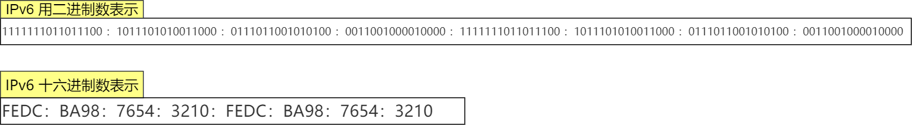

如果出现连续的 0 时还可以将这些 0 省略，并用两个冒号 「::」隔开。但是，一个 IP 地址中只允许出现一次两个连续的冒号。

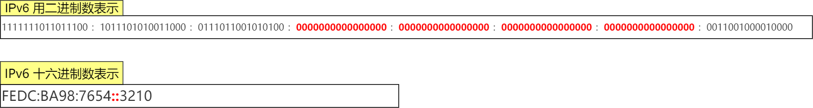

## IPv6 地址的分类

IPv6 类似 IPv4，也是通过 IP 地址的前几位标识 IP 地址的种类。主要有以下类型地址：

- 单播地址，用于一对一的通信
- 多播地址，用于一对多的通信
- 任播地址，用于通信最近的节点，最近的节点是由路由协议决定
- 没有广播地址

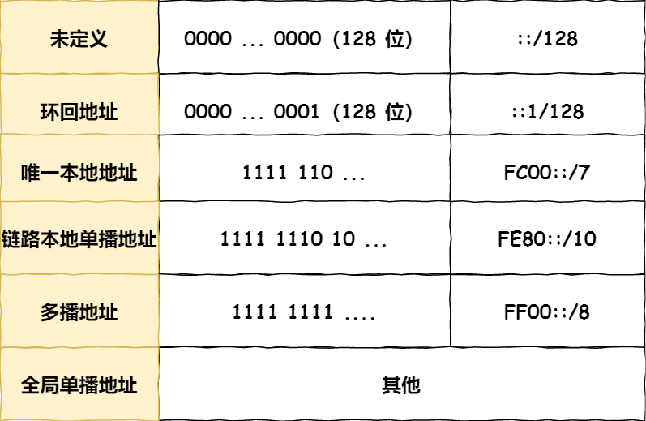

### IPv6 单播地址类型

对于一对一通信的 IPv6 地址，主要划分了三类单播地址，每类地址的有效范围都不同。

- 在同一链路单播通信，不经过路由器，可以使用**链路本地单播地址**，IPv4 没有此类型
- 在内网里单播通信，可以使用**唯一本地地址**，相当于 IPv4 的私有 IP
- 在互联网通信，可以使用**全局单播地址**，相当于 IPv4 的公有 IP

##  IPv4 首部与 IPv6 首部

IPv4 首部与 IPv6 首部的差异如下图：

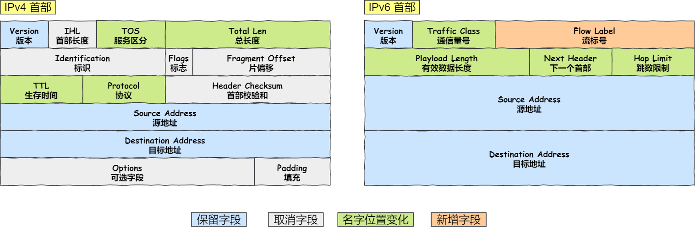

- **取消了首部校验和字段。** 因为在数据链路层和传输层都会校验，因此 IPv6 直接取消了 IP 的校验。
- **取消了分片/重新组装相关字段。** 分片与重组是耗时的过程，IPv6 不允许在中间路由器进行分片与重组，这种操作只能在源与目标主机，这将大大提高了路由器转发的速度。
- **取消选项字段。** 选项字段不再是标准 IP 首部的一部分了，但它并没有消失，而是可能出现在 IPv6 首部中的「下一个首部」指出的位置上。删除该选项字段使的 IPv6 的首部成为固定长度的 `40` 字节。

# IP 协议相关技术

## DNS

### 域名层级和DNS服务器

有一种服务器就专门保存了 `Web` 服务器域名与 `IP` 的对应关系，它就是 `DNS` 服务器。

DNS 中的域名都是用句点来分隔的，比如 `www.server.com`，这里的句点代表了不同层次之间的界限。在域名中，**越靠右的位置表示其层级越高**。实际上域名最后还有一个点，比如 `www.server.com.`，这个最后的一个点代表**根域名**。

所以域名的层级关系类似一个树状结构：

- 根 DNS 服务器（.）
- 顶级域 DNS 服务器（.com）
- 权威 DNS 服务器（server.com）

**根域的 DNS 服务器信息保存在互联网中所有的 DNS 服务器中**。因此，客户端只要能够找到任意一台 DNS 服务器，就可以通过它找到根域 DNS 服务器，然后再一路顺藤摸瓜找到位于下层的某台目标 DNS 服务器。

### 域名解析的工作流程

1. 浏览器会先看自身有没有对这个域名的缓存，如果有，就直接返回，如果没有，就去问操作系统；操作系统也会去看自己的缓存，如果有，就直接返回，如果没有，再去 hosts 文件看；也没有，再往下走
2. 客户端首先会发出一个 DNS 请求，问 www.server.com 的 IP 是啥，并发给**本地 DNS 服务器**（也就是客户端的 TCP/IP 设置中填写的 DNS 服务器地址）。
3. 本地域名服务器收到客户端的请求后，如果缓存里的表格能找到 www.server.com，则它直接返回 IP 地址。如果没有，本地 DNS 会去问它的根域名服务器：“老大， 能告诉我 www.server.com 的 IP 地址吗？” 根域名服务器是最高层次的，它不直接用于域名解析，但能指明一条道路。
4. 根 DNS 收到来自本地 DNS 的请求后，发现后置是 .com，说：“www.server.com 这个域名归 .com 区域管理”，我给你 .com 顶级域名服务器地址给你，你去问问它吧。”
5. 本地 DNS 收到顶级域名服务器的地址后，发起请求问“老二， 你能告诉我 www.server.com  的 IP 地址吗？”
6. 顶级域名服务器说：“我给你负责 www.server.com 区域的权威 DNS 服务器的地址，你去问它应该能问到”。
7. 本地 DNS 于是转向问权威 DNS 服务器：“老三，www.server.com对应的IP是啥呀？” server.com 的权威 DNS 服务器，它是域名解析结果的原出处。为啥叫权威呢？就是我的域名我做主。
8. 权威 DNS 服务器查询后将对应的 IP 地址 X.X.X.X 告诉本地 DNS。
9. 本地 DNS 再将 IP 地址返回客户端，客户端和目标建立连接。

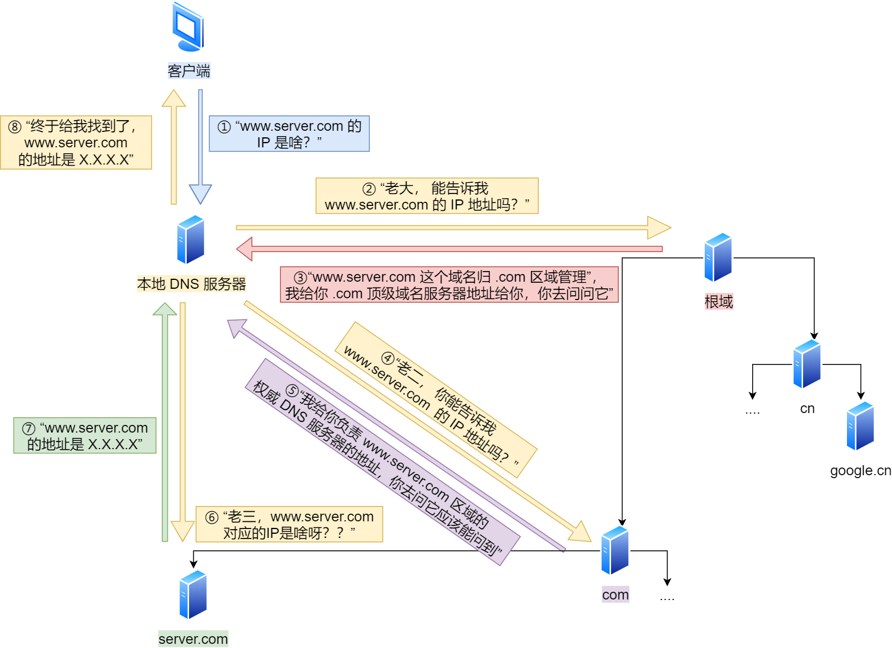

## ARP

网络层的下一层是数据链路层，所以我们还要知道「下一跳」的 MAC 地址。

由于主机的路由表中可以找到下一跳的 IP 地址，所以可以通过 **ARP 协议**，求得下一跳的 MAC 地址。

### ARP 协议流程

ARP 是借助 **ARP 请求与 ARP 响应**两种类型的包确定 MAC 地址的。

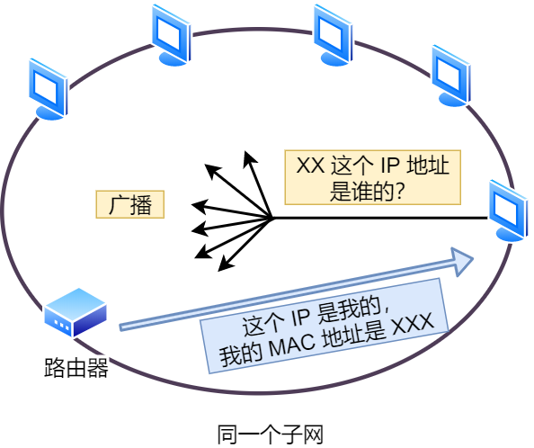

- 主机会通过**广播发送 ARP 请求**，这个包中包含了想要知道的 MAC 地址的主机 IP 地址。
- 当同个链路中的所有设备收到 ARP 请求时，会去拆开 ARP 请求包里的内容，如果 ARP 请求包中的目标 IP 地址与自己的 IP 地址一致，那么这个设备就将自己的 MAC 地址塞入 **ARP 响应包**返回给主机。
- 操作系统通常会把第一次通过 ARP 获取的 MAC 地址**缓存**起来，缓存有过期时间。

### RARP 协议

RARP 协议正好相反，它是**已知 MAC 地址求 IP 地址**。例如将打印机服务器等小型嵌入式设备接入到网络时就经常会用得到。

通常这需要架设一台 `RARP` 服务器，在这个服务器上注册设备的 MAC 地址及其 IP 地址。接着：

- 该设备会发送一条「我的 MAC 地址是XXXX，请告诉我，我的IP地址应该是什么」的请求信息。
- RARP 服务器接到这个消息后返回IP地址给这个设备

## DHCP

我们的电脑通常都是通过 DHCP 动态获取 IP 地址，大大省去了配 IP 信息繁琐的过程。

DHCP 客户端进程监听的是 68 端口号，DHCP 服务端进程监听的是 67 端口号。

- 客户端首先发起 **DHCP 发现报文（DHCP DISCOVER）** 的 IP 数据报，由于客户端没有 IP 地址，也不知道 DHCP 服务器的地址，所以使用的是 UDP **广播**通信，其使用的广播目的地址是 255.255.255.255（端口 67） 并且使用 0.0.0.0（端口 68） 作为源 IP 地址。DHCP 客户端将该 IP 数据报传递给链路层，链路层然后将帧广播到所有的网络中设备。
- DHCP 服务器收到 DHCP 发现报文时，用 **DHCP 提供报文（DHCP OFFER）** 向客户端做出响应。该报文仍然使用 IP 广播地址 255.255.255.255，该报文信息携带服务器提供可租约的 IP 地址、子网掩码、默认网关、DNS 服务器以及 **IP 地址租用期**。
- 客户端收到一个或多个服务器的 DHCP 提供报文后，从中选择一个服务器，并向选中的服务器发送 **DHCP 请求报文（DHCP REQUEST**进行响应，回显配置的参数。
- 最后，服务端用 **DHCP ACK 报文**对 DHCP 请求报文进行响应，应答所要求的参数。

如果租约的 DHCP IP 地址快期后，客户端会向服务器发送 DHCP 请求报文：

- 服务器如果同意继续租用，则用 DHCP ACK 报文进行应答，客户端就会延长租期。
- 服务器如果不同意继续租用，则用 DHCP NACK 报文，客户端就要停止使用租约的 IP 地址。

DHCP 交互中，**全程都是使用 UDP 广播通信**。

### DHCP 中继代理

如果 DHCP 服务器和客户端不是在同一个局域网内，路由器又不会转发广播包，那不是每个网络都要配一个 DHCP 服务器？

为了解决这一问题，就出现了 **DHCP 中继代理**。有了 DHCP 中继代理以后，对不同网段的 IP 地址分配也可以由一个 DHCP 服务器统一进行管理。

- DHCP 客户端会向 DHCP 中继代理发送 DHCP 请求包， DHCP 中继代理在收到这个广播包以后，再以**单播**的形式发给 DHCP 服务器。
- 服务器端收到该包以后再向 DHCP 中继代理返回应答，并由 DHCP 中继代理将此包广播给 DHCP 客户端 。

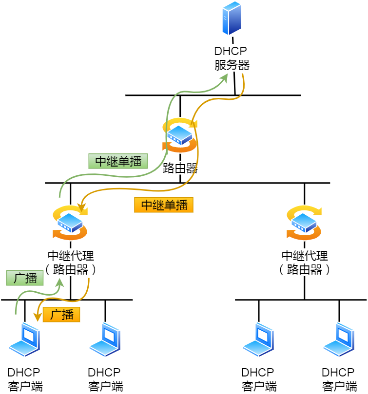

## NAT

一种**网络地址转换 NAT** 的方法，缓解了 IPv4 地址耗尽的问题。

简单的来说 NAT 就是同个公司、家庭、教室内的主机对外部通信时，把私有 IP 地址转换成公有 IP 地址。但那不是 N 个私有 IP 地址，你就要 N 个公有 IP 地址？所以普通的 NAT 转换没什么意义。

但可以把 IP 地址 + 端口号一起进行转换。这种转换技术就叫**网络地址与端口转换 NAPT。**

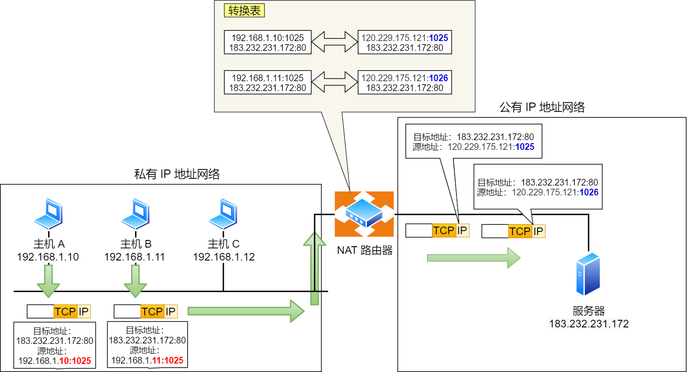

可以看到，两个私有 IP 地址都转换 IP 地址为公有地址 120.229.175.121，但是以不同的端口号作为区分。

### 缺点和解决

由于 NAT/NAPT 都依赖于自己的转换表，因此会有以下的问题：

- 外部无法主动与 NAT 内部服务器建立连接，因为 NAPT 转换表没有转换记录。
- 转换表的生成与转换操作都会产生性能开销。
- 如果 NAT 路由器重启了，所有的 TCP 连接都将被重置。

主要有两种解决方法：

- 改用 IPv6
- NAT 穿透技术：客户端主动从 NAT 设备获取公有 IP 地址，然后自己建立端口映射条目，然后用这个条目对外通信，就不需要 NAT 设备来进行转换了。

## ICMP

ICMP 全称是 **Internet Control Message Protocol**，也就是**互联网控制报文协议**。

主要的功能包括：

- 确认 IP 包是否成功送达目标地址
- 报告发送过程中 IP 包被废弃的原因和改善网络设置等

linux 的 ping 命令就是会发送 ICMP 包，检测网络连接。

在 `IP` 通信中如果某个 `IP` 包因为某种原因未能达到目标地址，那么这个具体的原因将**由 ICMP 负责通知**。

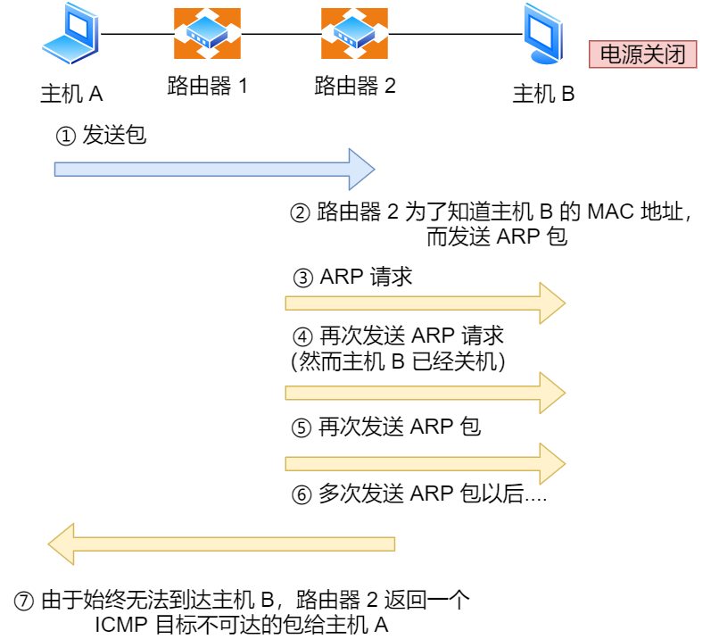

### ICMP 类型

ICMP 大致可以分为两大类：

- 一类是用于诊断的查询消息，也就是「**查询报文类型**」
- 另一类是通知出错原因的错误消息，也就是「**差错报文类型**」

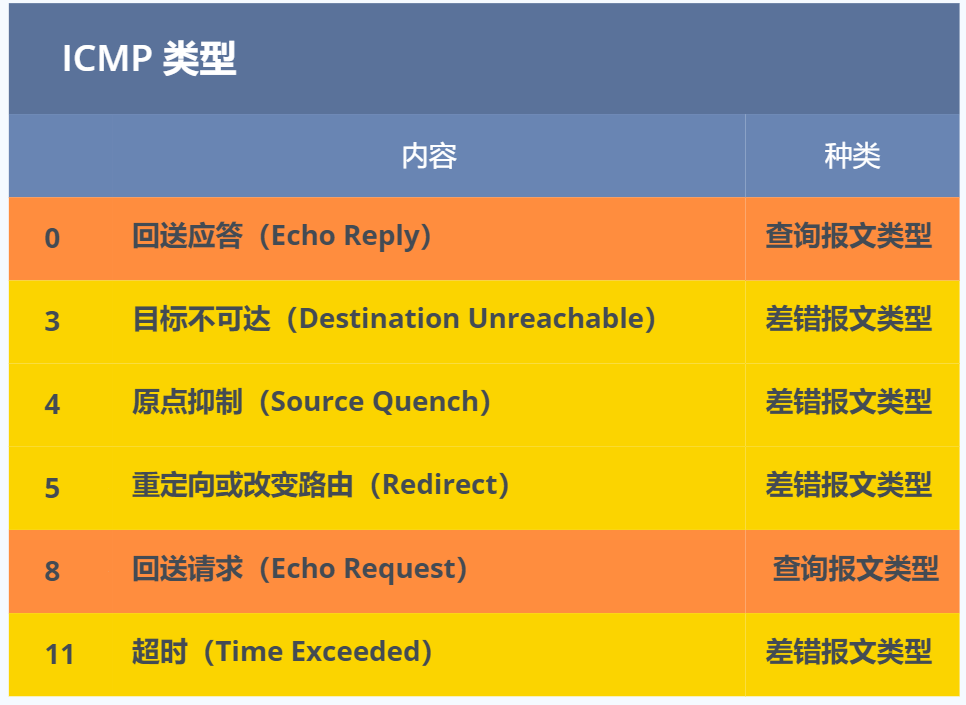

## IGMP

前面我们知道了组播地址，也就是 D 类地址，怎么管理是否是在一组呢？就需要 `IGMP` 协议了。

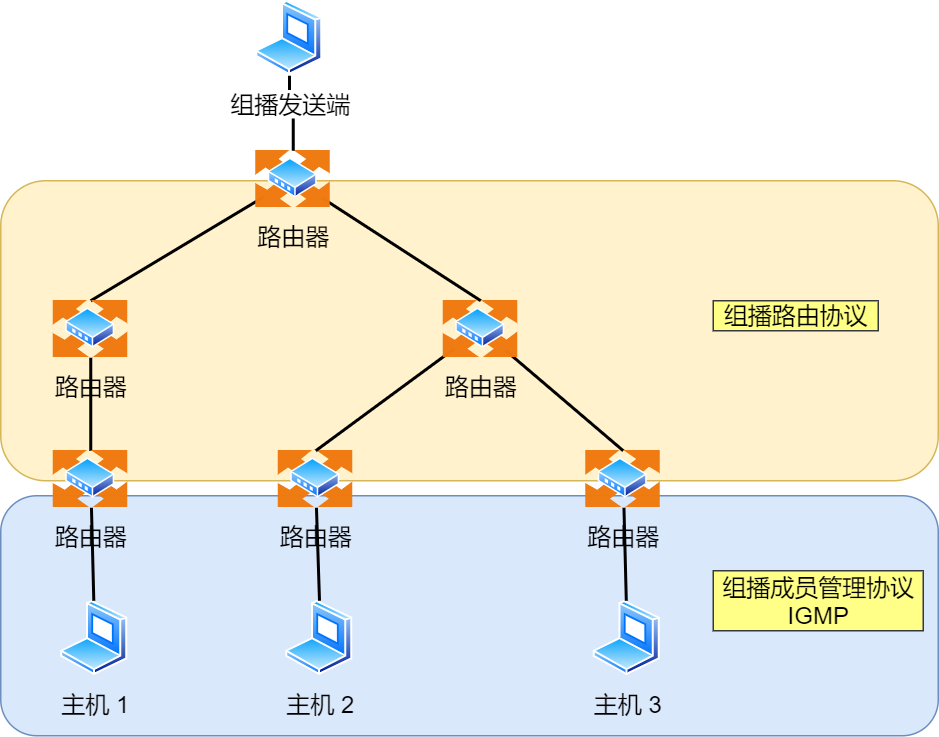

**IGMP 是因特网组管理协议，工作在主机（组播成员）和最后一跳路由之间**，如上图中的蓝色部分。

- IGMP 报文向路由器申请加入和退出组播组，默认情况下路由器是不会转发组播包到连接中的主机，除非主机通过 IGMP 加入到组播组，主机申请加入到组播组时，路由器就会记录 IGMP 路由器表，路由器后续就会转发组播包到对应的主机了。
- IGMP 报文采用 IP 封装，IP 头部的协议号为 2，而且 TTL 字段值通常为 1，因为 IGMP 是工作在主机与连接的路由器之间。

### IGMP 工作机制

IGMP 分为了三个版本分别是，IGMPv1、IGMPv2、IGMPv3。以 `IGMPv2` 作为例子，说说**常规查询与响应和离开组播组**这两个工作机制。

#### 常规查询与响应工作机制

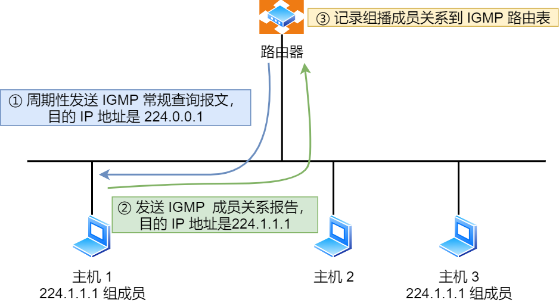

1. 路由器会周期性发送目的地址为 `224.0.0.1`（表示同一网段内所有主机和路由器） **IGMP 常规查询报文**。
2. 主机1 和 主机 3 收到这个查询，随后会启动「报告延迟计时器」，计时器的时间是随机的，通常是 0~10 秒，计时器超时后主机就会发送 **IGMP 成员关系报告报文**（源 IP 地址为自己主机的 IP 地址，目的 IP 地址为组播地址）。如果在定时器超时之前，收到同一个组内的其他主机发送的成员关系报告报文，则自己不再发送，这样可以减少网络中多余的 IGMP 报文数量。
3. 路由器收到主机的成员关系报文后，就会在 IGMP 路由表中加入该组播组，后续网络中一旦该组播地址的数据到达路由器，它会把数据包转发出去。

#### 离开组播组工作机制

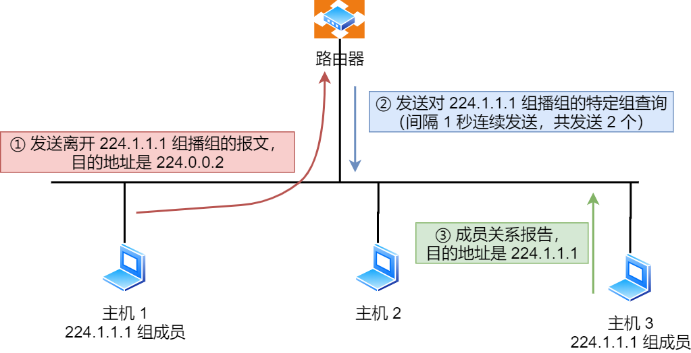

1. 主机 1 要离开组 224.1.1.1，发送 IGMPv2 离组报文，报文的目的地址是 224.0.0.2（表示发向网段内的所有路由器）
2. 路由器 收到该报文后，以 1 秒为间隔连续发送 IGMP 特定组查询报文（共计发送 2 个），以便确认该网络是否还有 224.1.1.1 组的其他成员。
3. 主机 3 仍然是组 224.1.1.1 的成员，因此它立即响应这个特定组查询。路由器知道该网络中仍然存在该组播组的成员，于是继续向该网络转发 224.1.1.1 的组播数据包。
   - 如果主机 3 也离开组，一定时间后，路由器认为该网段中已经没有 224.1.1.1 组播组成员了，将不会再向这个网段转发该组播地址的数据包。

离开组播组的情况二，网段中没有该组播组：